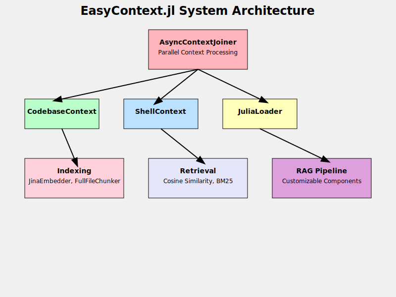

# EasyContext.jl

EVERYTHING is refactored...
Docs is lacking behind! Literally everything is changed... so you can check the AISH.jl for example. 

EasyContext.jl is a Julia package that enhances the context-aware capabilities of AI-powered applications. It provides tools for efficient document indexing, embedding, and retrieval, making it easier to build robust Retrieval-Augmented Generation (RAG) systems.


## Features

- **Flexible Embedding Options**: Supports multiple embedding models, including Jina AI's embedding services.
- **Efficient Indexing**: Utilizes various indexing strategies for quick and relevant information retrieval.
- **Advanced Retrieval**: Implements sophisticated retrieval methods, including cosine similarity and BM25.
- **Context-Aware Processing**: Provides context processors for different types of information sources, such as codebase files and Julia packages.
- **Integration with Julia Ecosystem**: Seamlessly indexes and retrieves information from installed Julia packages.
- **Customizable RAG Pipeline**: Offers a configurable RAG system with interchangeable components for indexing, retrieval, and generation.
- **Parallel Context Processing**: Uses `AsyncContextJoiner` for efficient, concurrent context retrieval from multiple sources.

## System Architecture

The following diagram illustrates the inner workings of EasyContext.jl:



This diagram shows how the AsyncContextJoiner orchestrates parallel processing of different context sources (CodebaseContext, ShellContext, and JuliaLoader). The results are then used in the indexing and retrieval processes, which feed into the customizable RAG pipeline.

## Installation

To install EasyContext.jl, use the Julia package manager:

```julia
using Pkg
Pkg.add("EasyContext")
```

## Usage

Here's an example of how to use EasyContext.jl with various context processors:

```julia
using EasyContext
using PromptingTools

# Initialize the AsyncContextJoiner with multiple processors
joiner = AsyncContextJoiner(
    processors=[
        CodebaseContextV2(),
        ShellContext(),
        JuliaLoader(),
    ],
    keep=10,
    max_messages=16
)

# Create an EasyContextCreatorV3 instance
creator = EasyContextCreatorV3(joiner=joiner)

# Prepare AI state (you might need to adjust this based on your specific setup)
ai_state = AIState()

# Define a question
question = "How do I use DifferentialEquations.jl to solve an ODE?"

# Get context from multiple sources concurrently
context = get_context(joiner, creator, question, ai_state, Dict())

println("Combined context from multiple sources:")
println(context)

# If you want to use individual context processors:

# Get context from codebase
codebase_context = get_context(CodebaseContextV2(), question, ai_state, Dict())
println("Codebase context:")
println(codebase_context)

# Get context from Julia packages
package_context = get_context(JuliaLoader(), question, ai_state, Dict())
println("Julia package context:")
println(package_context)

# Get context from shell
shell_context = get_context(ShellContext(), question, ai_state, Dict())
println("Shell context:")
println(shell_context)

# Use the context in your RAG pipeline
# ... (implement your RAG logic here)
```

## Main Components

1. **JinaEmbedder**: A struct for embedding documents using Jina AI's embedding models.
2. **FullFileChunker**: A chunker that processes entire files as single chunks.
3. **SourceChunker**: A specialized chunker for Julia source code.
4. **ReduceGPTReranker**: A reranker that uses GPT models to improve retrieval results.
5. **AsyncContextJoiner**: A component that runs multiple context processors in parallel.
6. **Various Context Processors**: Including CodebaseContext, ShellContext, and JuliaLoader.

## Advanced Features

- **Multi-Index Support**: Combine different indexing strategies for more comprehensive retrieval.
- **Asynchronous Processing**: Utilize Julia's multi-threading capabilities for faster embedding and retrieval.
- **Caching**: Implement caching mechanisms to speed up repeated queries and reduce API calls.

## Tool Interface Flow
```
┌─ ─ ─ ─ ─ ─ ─ ─ ─ ─ ─ ─┐
  ToolTag                 Parsed from the LLM output, e.g. ToolTag(name="CALC", args="2 + 2") 
└─ ─ ─ ─┬─ ─ ─ ─ ─ ─ ─ ─┘
        │
--------▼----------- Tool Interface Implementation 
┌────────────────────────┐
│ instantiate(::ToolTag) │ Creates Tool instance from ToolTag
└───────┬────────────────┘
        │
        ▼
┌─ ─ ─ ─┴─ ─ ─ ─┐
  LLM_safetorun   Optional AI safety check before auto-execution
└─ ─ ─ ─┬─ ─ ─ ─┘   (e.g. verify shell commands without user prompt)
        │
        ▼
┌─ ─ ─ ─┴─ ─ ─ ─┐
  preprocess()    Optional content preparation
└─ ─ ─ ─┬─ ─ ─ ─┘   (e.g. LLM modifications, cursor-like instant apply)
        │
        ▼
┌───────────────┐
│ execute()     │ Performs the actual operation
└───────┬───────┘
--------│----------- End of Interface
        ▼
┌─ ─ ─ ─┴─ ─ ─ ─┐
  Results         Collected for LLM context
└─ ─ ─ ─ ─ ─ ─ ─┘
```

### Example: Creating a Simple Tool

Here's an example of implementing a basic calculator tool:

```julia
# Define tool struct
@kwdef struct CalcTool <: AbstractTool
    id::UUID = uuid4()
    expression::String
end

# Create tool from tag
CalcTool(cmd::ToolTag) = CalcTool(expression=cmd.args)

# Define tool metadata
toolname(::Type{CalcTool}) = "CALC"
get_description(::Type{CalcTool}) = """
Calculate mathematical expressions:
CALC 2 + 2 #RUN
"""
stop_sequence(::Type{CalcTool}) = "#RUN"

# Implement main operation
function execute(tool::CalcTool)
    try
        result = eval(Meta.parse(tool.expression))
        return "Result: $result"
    catch e
        return "Error: Invalid expression"
    end
end
```

Usage example:
```julia
# Parse tool tag
tag = ToolTag(name="CALC", args="2 + 2")

# Create and execute tool
calc = instantiate(Val(:CALC), tag) 
result = execute(calc)
# => "Result: 4"
```

## Contributing

Contributions to EasyContext.jl are welcome! Please feel free to submit issues, feature requests, or pull requests on our GitHub repository.

## License

EasyContext.jl is released under the MIT License. See the LICENSE file in the project repository for more details.
EOF
